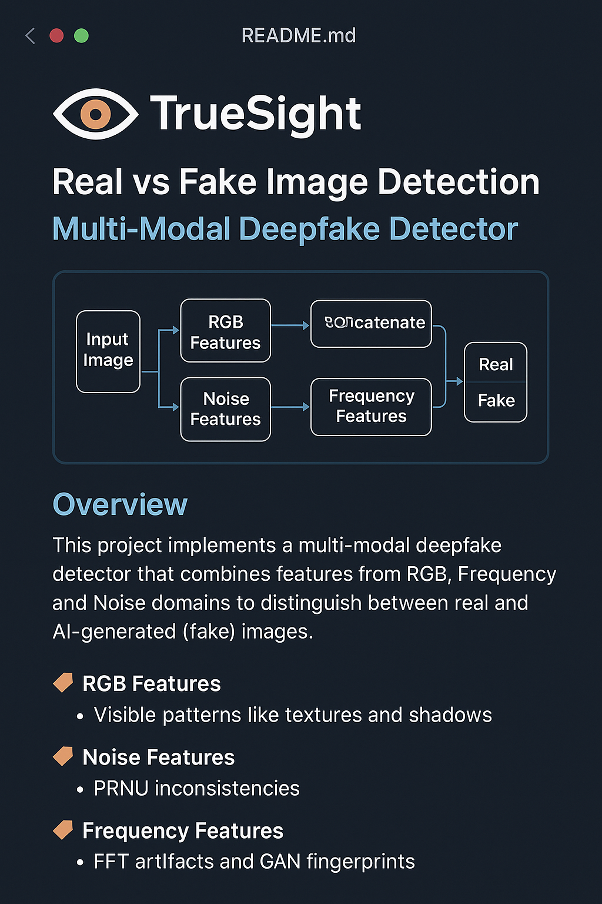

# 🧠 TrueSight_AI – Multi-Modal Deepfake Detection System  
### RGB + Noise + Frequency Feature Fusion for Real vs Fake Image Classification

TrueSight_AI is an advanced deepfake detection architecture that analyzes images in **three domains**:

- **RGB Domain** → visual artifacts  
- **Noise Domain (PRNU Residuals)** → missing camera sensor noise  
- **Frequency Domain (FFT Patterns)** → GAN fingerprint patterns  

By combining these, TrueSight_AI achieves far higher accuracy than single-branch CNN models.

---

# 📊 System Flowchart

Place your generated flowchart image in the repo as:  
`flowchart.png`

```md
](flowchart.png)

📘 1. Overview
Deepfake detection is hard using RGB alone. AI-generated images leave hidden clues in:

Domain	What It Detects	Why It Works
RGB	Visual noise, textures, shadows	GANs hallucinate micro-details
Noise	Missing PRNU	No real camera sensor → fake
Frequency	Checkerboard patterns, FFT spikes	Strong GAN artifacts

TrueSight_AI extracts all three representations and merges them into a multi-modal classifier.

🧬 2. Theory Behind Each Branch
🔴 RGB Branch
CNN extracts:

Texture detail

Color patterns

Edge behavior

Micro-structure inconsistencies

🟣 Noise Branch (PRNU Residuals)
Noise map extracted via:

ini
Copy code
Noise = Image - GaussianBlur(Image)
Real cameras contain PRNU → AI-generated images do not.
Noise branch detects:

Missing sensor patterns

Over-smoothing

Bad denoising artifacts

🔵 Frequency Branch (FFT Features)
FFT highlights hidden GAN artifacts:

High-frequency spikes

Moiré patterns

Checkerboard artifacts

Periodic GAN residuals

These patterns are invisible in RGB but obvious in frequency domain.

🏗 3. Project Structure
go
Copy code
TrueSight_AI/
│── model.py
│── train.py
│── test_model.py
│── predict_single.py
│── verify_setup.py
│── dataset.py
│── feature_extractor.py
│── saved/
│    ├── best_model.pth
│    ├── training_curves.png
│    ├── confusion_matrix.png
│── dataset/
     ├── train/
     │    ├── real/
     │    └── fake/
     └── test/
          ├── real/
          └── fake/
flowchart.png
⚙️ 4. Installation
bash
Copy code
pip install torch torchvision opencv-python pillow numpy matplotlib tqdm seaborn scikit-learn
🧪 5. Verify Setup
Run:

bash
Copy code
python verify_setup.py
Checks:

Dataset exists

Model imports

GPU availability

Image loaders

🏋️ 6. Train the Model
bash
Copy code
python train.py
Creates:

best_model.pth

training_curves.png

confusion_matrix.png

metrics.json

🧾 7. Evaluate Full Test Dataset
bash
Copy code
python test_model.py
Outputs:

Accuracy

Precision

Recall

F1-Score

Confusion matrix

Wrong predictions

🖼 8. Predict Single Image
bash
Copy code
python predict_single.py image.jpg
Visualization:

bash
Copy code
python predict_single.py image.jpg --visualize
📁 9. Predict a Folder
bash
Copy code
python predict_single.py dataset/test/fake/
📊 10. Generated Outputs
Training curve

Confusion matrix

Real vs Fake confidence

Per-image prediction logs

🛠 11. Troubleshooting
❗ Low accuracy
Add more images

Increase training epochs

Enable augmentations

❗ GPU/CPU slow
Lower batch size

Use mixed precision

❗ Prediction wrong for some images
Noise + Frequency branches help

Ensure input images are clean

🚀 12. Future Enhancements
Add Vision Transformer (ViT) branch

Add Wavelet Transform (DWT)

Integrate CLIP features

Deploy using FastAPI or Streamlit

❤️ Credits
Developed as part of TrueSight_AI: A Multi-Modal Deepfake Detection Research Project.
Combining RGB + Noise + Frequency domains pushes detection accuracy to a new level.
